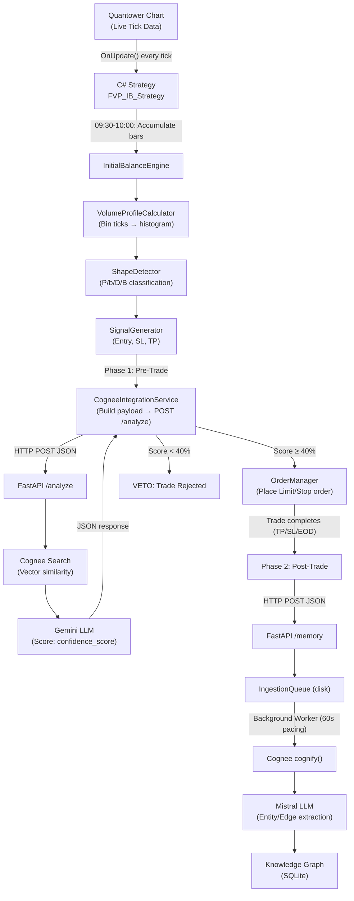

# Comprehensive Project Documentation
## FVP_IB_Strategy (C#) & FVP_IB_Cognee_Backend (Python)

---

## 1. Project Vision & Problem Statement

**The Problem:** Traditional trading bots execute trades based on rigid, hardcoded mathematical rules. When market conditions shift, they keep losing money because they have zero memory of past mistakes or successes.

**The Solution:** We built a **hybrid AI-assisted automated trading system** that combines:
- A high-performance **C# Execution Engine** (Quantower SDK) for sub-second order execution and real-time market structure analysis (Volume Profile, Initial Balance).
- A **Python AI Backend** (FastAPI + Cognee + LiteLLM) that acts as a cognitive "Brain" — storing every trade outcome in a Knowledge Graph, and using Retrieval-Augmented Generation (RAG) to veto bad setups before they cost money.

---

## 2. Architecture Overview

### Polyrepo Design (Strict Separation)
The ecosystem is enforced as **two completely separate Git repositories**:

| Property | FVP_IB_Strategy | FVP_IB_Cognee_Backend |
|---|---|---|
| **Language** | C# (.NET 10) | Python 3 |
| **Framework** | Quantower SDK (`TradingPlatform.BusinessLayer`) | FastAPI + Uvicorn |
| **Role** | Execution Engine (the "Hands") | AI Memory Brain |
| **Git Branch** | `feature/phase2` | `feature/phase2_congee` |
| **Path** | `FVP_IB_Strategy/` | `FVP_IB_Cognee_Backend/` |

> [!IMPORTANT]
> These two repos push to the **same remote submission repo** but on **different branches** to prevent overwrites.

---

## 3. Complete File Structure & Purpose

### 3.1 FVP_IB_Strategy (C# — 14 directories, 11 root files)

```
FVP_IB_Strategy/
├── .agents/AGENTS.md              # 117 lines of project-specific rules
├── FVP_IB_Strategy.sln            # Visual Studio solution file
├── FVP_IB_Strategy.csproj         # .NET 10 project targeting Quantower SDK
│
├── Strategies/                    # Strategy (partial class, 4 files)
│   ├── FVP_IB_Strategy.cs             # Entry point: OnRun(), OnStop()
│   ├── FVP_IB_Strategy.Settings.cs    # UI InputParameters & private state fields
│   ├── FVP_IB_Strategy.Execution.cs   # OnUpdate() tick loop, IB calc, trade logic
│   └── FVP_IB_Strategy.Reporting.cs   # Position tracking, CSV export, PnL extraction
│
├── Calculations/                  # Core math engine (10 files)
│   ├── InitialBalanceEngine.cs        # Orchestrates IB calculation pipeline
│   ├── VolumeProfileCalculator.cs     # Bins tick data into volume histogram, calculates VA
│   ├── ShapeDetector.cs               # Classifies profiles: PShape, bShape, DShape, BShape
│   ├── SignalGenerator.cs             # Produces TradeSignal (Entry, SL, TP) per shape
│   ├── CogneeIntegrationService.cs    # Builds AI payloads, HTTP POST to Python backend
│   ├── DataIngestionService.cs        # Extracts IB-phase bars from HistoricalData
│   ├── ExecutionSimulator.cs          # Intra-bar SL/TP sweep for backtesting
│   ├── ReportExporter.cs              # CSV file writer with in-memory buffering
│   ├── TvReplicaBalanceEngine.cs      # TradingView-style IB replica engine
│   └── TzHelper.cs                    # Cross-platform EST/EDT timezone resolver
│
├── Execution/                     # Order placement layer (1 file)
│   └── OrderManager.cs                # Limit/Stop order builder with slippage protection
│
├── Models/                        # Data structures (4 files)
│   ├── MarketData.cs                  # IB_High, IB_Low, POC, VAH, VAL, Shape, Signal
│   ├── PayloadContext.cs              # DTO for CogneeIntegrationService
│   ├── TradingContext.cs              # Account, Symbol, OrderTypeId, LogAction
│   └── Enums.cs                       # VolumeProfileShape enum (PShape, bShape, DShape, BShape)
│
├── Config/
│   └── ProjectPaths.cs                # Dynamic path resolution for Quantower output dirs
│
├── UI/Indicators/                 # Visual chart overlays (4 files)
│   ├── IBVisualizerIndicator.cs           # Main indicator: IB calc + GDI+ rendering
│   ├── IBVisualizerIndicator.Settings.cs  # Indicator UI inputs
│   ├── IBVisualizerIndicator.Drawing.cs   # GDI+ drawing: VA bands, POC line, HUD panels
│   └── IBVisualizerIndicator_TV_Replica.cs # TradingView-style replica indicator
│
├── Releases/                      # Archived compiled DLLs
│   ├── FVP_IB_Strategy_V1.dll
│   ├── FVP_IB_Strategy_V1.1.dll
│   └── FVP_IB_Strategy_V2.dll
│
├── Documentation/                 # 12 design & explanation docs
│   ├── FVP_IB_Project_LLM_DeepDive.md
│   ├── FVP_IB_Trading_Logic.md
│   ├── Future_Roadmap_OrderFlow.md
│   ├── strategy_specification.md
│   └── ... (CoreLogic.md, Quantower_Master_Reference.md, etc.)
│
├── Explanations/                  # Audience-specific pitch docs
│   ├── architect_explanation.md
│   ├── developer_explanation.md
│   ├── retail_trader_explanation.md
│   ├── investor_pitch.md
│   ├── hackathon_pitch.md
│   ├── data_flow_deep_dive.md
│   └── sample_data_flow_walkthrough.md
│
├── CONGEE/                        # Cognee SQLite data (graph + vectors)
│   ├── .cognee_data/
│   └── .cognee_system/
│
└── bin/ & obj/                    # Build output
```

### 3.2 FVP_IB_Cognee_Backend (Python — 8 directories, 34 files)

```
FVP_IB_Cognee_Backend/
├── .agents/AGENTS.md              # 117 lines of backend-specific rules
├── .env                           # API keys (Gemini, Mistral, LiteLLM routing)
├── .venv/                         # Python virtual environment
├── requirements.txt               # All pip dependencies
│
├── main.py                        # FastAPI app: /analyze and /memory endpoints
├── llm_service.py                 # Cognee search, Gemini scoring, memory ingestion
├── queue_manager.py               # Async background worker with 60s RPM pacing
├── console_ui.py                  # ASCII startup banner (no emojis — Windows safe)
├── router_config.yaml             # LiteLLM proxy: model routing definitions
│
├── 0_STOP_ALL_SERVERS.bat         # Kill LiteLLM + FastAPI processes
├── 1_START_ALL_SERVERS.bat        # Launch both servers
├── 2_START_LITELLM_PROXY.bat      # Start LiteLLM proxy on port 4000
├── 3_START_COGNEE_ENGINE.bat      # Start FastAPI on port 8000
├── 4_CLEAR_BRAIN.bat              # Wipe Cognee graph database
│
├── clear_brain.py                 # Python script to reset Cognee data
├── dump_graph.py                  # Debug: dump graph contents
├── run_cognify.py                 # Manual cognify trigger
├── list_models.py                 # List available LiteLLM models
│
├── IngestionQueue/                # Disk-based Write-Ahead Log for payloads
├── ArchivedPayloads/              # Permanent archive of all received payloads
├── Processed_Sessions.txt         # Idempotency bouncer: prevents duplicate ingestion
├── Quantitative_Trade_Log.jsonl   # Structured math ledger of all trade fields
│
├── test_payloads/                 # Sample payloads for manual testing
├── Benchmark/                     # Performance test scripts
│
├── gemini_output.json             # Cached Gemini API responses (debug)
├── mistral_output.json            # Cached Mistral API responses (debug)
└── test_*.py                      # Various unit test scripts
```

---

## 4. Technology Stack

### C# Engine
| Technology | Version | Purpose |
|---|---|---|
| .NET SDK | 10.0 | Runtime |
| C# Language | Latest | Core language |
| Quantower SDK | v1.146.14 | `TradingPlatform.BusinessLayer.dll` |
| System.Drawing.Common | 10.0.9 | GDI+ chart rendering |
| System.Text.Json | Built-in | JSON serialization (replaced manual string interpolation) |

### Python Backend
| Technology | Version | Purpose |
|---|---|---|
| Python | 3.x | Runtime |
| FastAPI | Latest | HTTP API server |
| Uvicorn | Latest | ASGI server |
| Cognee | v1.0+ | Knowledge Graph engine |
| LiteLLM | Latest | Multi-model AI proxy router |
| OpenAI SDK | Latest | Chat completion client (routed via LiteLLM) |
| SQLite | Embedded | Cognee graph + vector storage |

### AI Models (via LiteLLM Proxy on port 4000)
| Model | Provider | Role |
|---|---|---|
| `gemini-3.1-flash-lite` | Google | `/analyze` scoring (confidence + win rate) |
| `gemini-embedding-2` | Google | Vector embeddings for semantic search |
| Mistral-Large (via Nara Router) | Mistral | `cognify()` entity/edge extraction |

---

## 5. End-to-End Data Flow (The Complete Lifecycle)



### Phase 1: Pre-Trade Query (`/analyze`)

**Trigger:** IB range confirmed at 10:00 AM EST.

**C# builds this payload:**
```
[SESSION ID: MNQU4_2026-07-05]
[MARKET CONTEXT NODE]
Strategy: FVP_IB_Strategy
Event Tag: PRE_TRADE: Signal Generated
Day of Week: Saturday
Asset Group: NQ
Asset: MNQU4
Timestamp: 2026-07-05 10:00:15

[STRUCTURAL STATE NODE]
Profile Shape: Normal Variation
Total Session Volume: 45230
Session Extremes: IB_High 19850.50 | IB_Low 19780.25
Value Area: VAH 19830.00 (71.4%) | POC 19815.50 (50.4%) | VAL 19790.25 (14.3%)
Microstructure: HVN1 19815.50 | HVN2 N/A | LVN_Gap N/A
```

**Wrapped as JSON and sent via HTTP POST:**
```json
{
  "payload": "[SESSION ID: MNQU4_2026-07-05]\n[MARKET CONTEXT NODE]\n...",
  "fields": {
    "session_id": "MNQU4_2026-07-05",
    "symbol": "MNQU4",
    "ib_high": 19850.50,
    "ib_low": 19780.25,
    "ib_poc": 19815.50,
    "ib_vah": 19830.00,
    "ib_val": 19790.25,
    "ib_hvn1": "19815.50",
    "ib_hvn2": "N/A",
    "ib_lvn": "N/A"
  }
}
```

**Python returns:**
```json
{
  "status": "success",
  "confidence_score": "72",
  "historical_win_rate": "65%",
  "narrative": "Similar PShape setups on Mondays have hit TP 65% of the time."
}
```

### Phase 2: Post-Trade Memory Ingestion (`/memory`)

**Trigger:** Trade hits TP, SL, or EOD flatten. C# sends the full lifecycle:

```
[SESSION ID: MNQU4_2026-07-05]
[MARKET CONTEXT NODE]
Strategy: FVP_IB_Strategy
Event Tag: POST_TRADE: Target Achieved
...

[EXECUTION PLAN NODE]
System Bias: LONG
Order Setup: Entry 19815.50 | Take Profit 19850.50 | Stop Loss 19790.25

[OUTCOME NODE]
Result: TP Hit
Exit Reason: TP Hit

[RELATIONAL SUMMARY]
At 10:00:15 on Saturday, 2026-07-05, MNQU4 established its Initial Balance,
resolving into a Normal Variation distribution with a total volume of 45230.
The outcome of the setup was a TP Hit due to TP Hit.
```

**JSON wrapper includes `auto_cognify` flag and structured `fields`:**
```json
{
  "payload": "...",
  "auto_cognify": true,
  "fields": {
    "session_id": "MNQU4_2026-07-05",
    "symbol": "MNQU4",
    "event_tag": "POST_TRADE: Target Achieved",
    "ib_high": 19850.50, "ib_low": 19780.25,
    "ib_poc": 19815.50, "ib_vah": 19830.00, "ib_val": 19790.25,
    "total_volume": 45230,
    "entry_price": 19815.50, "take_profit": 19850.50, "stop_loss": 19790.25,
    "trade_result": "TP Hit", "exit_reason": "TP Hit"
  }
}
```

**Python processing chain:**
1. **Idempotency Bouncer** checks `Processed_Sessions.txt` → blocks duplicates
2. **Math Ledger** appends `fields` to `Quantitative_Trade_Log.jsonl`
3. **Archive** saves full JSON to `ArchivedPayloads/`
4. **Queue** writes file to `IngestionQueue/` → returns `200 OK` instantly
5. **Background Worker** picks up file after 60s pacing delay
6. `cognee.add(payload)` → injects raw text into Cognee
7. If `auto_cognify=true` AND `trade_result="EOD Flatten"` → `cognee.cognify()` extracts entities/edges via Mistral LLM
8. Gemini embeds nodes as vectors into SQLite for future similarity search

---

## 6. Volume Profile Shape Classification

The `ShapeDetector.cs` classifies the IB volume histogram into 4 distinct shapes:

| Shape | POC Position | Trading Signal | Meaning |
|---|---|---|---|
| **PShape** | Upper 40% of range | LONG at POC → TP at IB_High | Heavy buying — institutions accumulated at the top |
| **bShape** | Lower 40% of range | SHORT at POC → TP at IB_Low | Heavy selling — institutions distributed at the bottom |
| **DShape** | Middle 20% of range | FADE at VAL → TP at POC | Balanced/neutral — mean reversion play |
| **BShape** | Bimodal (2 peaks) | Direction depends on HVN1 vs LVN position | Double distribution — liquidity vacuum between two HVNs |

**BShape validation requires both:**
- HVN2 volume ≥ 30% of max volume (`hvn2MinRatio`)
- LVN valley volume < 12% of max volume (`lvnThreshold`)

---

## 7. Webhook Architecture Scenarios (3 Modes)

| Mode | Enable Webhook | Auto Trigger Gemini | Behavior |
|---|---|---|---|
| **Offline** | OFF | OFF | Logs payloads to local `quant_engine.log` only |
| **Record** | ON | OFF | POSTs to Python, saves to `IngestionQueue/` — no AI processing |
| **Full AI** | ON | ON | Full pipeline: POST → Queue → Cognee → Mistral extraction → Graph |

---

## 8. All Bug Fixes Applied (Chronological)

### Critical Severity
| ID | Bug | Root Cause | Fix |
|---|---|---|---|
| C1 | AI Fail-Open (trades when backend down) | `catch` block bypassed validation | **Fail-Closed** design: abort trade + set `hasTradedToday=true` |
| C2 | EOD Double-Close (broker spam) | Position check on every tick while close is routing | `eodFlattenSent` boolean flag + `Core.Instance.ClosePosition()` |
| C3 | Limit at 0 (broker rejection) | Manual order builder missing price | Replaced with Quantower native `ClosePosition()` |

### High Severity
| ID | Bug | Root Cause | Fix |
|---|---|---|---|
| H1 | Default tick size on TV Replica | Hardcoded 0.25 instead of `symbol.TickSize` | Passed dynamic `symbol.TickSize` into `GenerateSignal()` |
| H2 | Thread-safety crash | Background AI thread mutated strategy state | **Polling Architecture**: background writes to `volatile` field, platform thread reads |
| H3 | PnL exit reconstruction guessing | Used live `marketData.Signal` instead of snapshot | `lastExecutedSignal` snapshot taken at order placement |
| H4 | AI retry storm | Failed webhook never set `hasTradedToday` | Explicit flag set in `catch` block |

### Medium Severity
| ID | Bug | Root Cause | Fix |
|---|---|---|---|
| M1 | Fragile JSON | Manual string interpolation | `System.Text.Json.JsonSerializer.Serialize()` |
| M2 | Memory leak | `processedPositionIds` never cleared | Clear on session reset |
| M3 | Hardcoded slippage | 20 * TickSize baked in | Exposed as UI `SlippageToleranceTicks` input |
| M4/M5 | `istTz` naming + Windows-only | Misleading variable name | Renamed to `estTz` + `TzHelper.cs` cross-platform fallback |

---

## 9. Skills & Rules (Local + Global)

### Global Skills Used
| Skill | Path | Purpose |
|---|---|---|
| `quantower-development` | `C:\Users\Admin\.gemini\config\skills\quantower-development\` | Scaffolding, lifecycle hooks, GDI+, backtesting guardrails |

### Workspace Root Rules (`.agents/AGENTS.md`)
1. **Strict Alignment Between Backtests and Strategy Blueprints** — No hallucinated parameters
2. **Backtest Reporting: Day of Week Analysis** — Monday-Friday breakdown mandatory
3. **Strict Anti-Monolithic Architecture & Root Cause Analysis** — SoC, interval reviews, no patches

### FVP_IB_Strategy Rules (`.agents/AGENTS.md` — 117 lines)
1. Quantower Backtesting & PnL extraction (`dynamic grossPnl = obj.GrossPnL`)
2. UI Feedback reset per session
3. External DLL Deployment Cleanup
4. Limit Order Type Bug prevention
5. 4-Phase Development Roadmap enforcement
6. Architectural Refactoring — mandatory impact audit
7. Release & DLL versioning management
8. Version Naming Sync across UI
9. Git Workflow guardrails
10. Market Replay & Historical Array Indexing (reverse-chronological)
11. Cognee Ingestion & API Pacing (The Cognee Multiplier)
12. AI Payload Lifecycle (2-Phase Model)
13. Repository Structure (Polyrepo Enforcement)

### FVP_IB_Cognee_Backend Rules (`.agents/AGENTS.md` — 117 lines)
1. Professional Developer Naming Conventions (no "AI" buzzwords)
2. Cognee v1.0 API Search Types (`CHUNKS` not `INSIGHTS`)
3. Safe Terminal Output — no emojis on Windows
4. Webhook Architecture 3-Scenario enforcement
5. C# Indicator UI/UX Standards (GDI+ anchoring, transparency)
6. Strict Explicit Confirmation Requirement
7. C# Code Modularity (`partial class` at 500+ lines)
8. Comprehensive Planning Scope
9. Shared Submission Repo & Multi-Branch Strategy
10. Strict SoC & DRY Architecture
11. Private Documentation Repository awareness

### Global User Rules (applied everywhere)
- Strict Version Control Guardrail
- Databento Calendar Spread Corruption filter
- Forward-Looking Bias Prevention (The Time Wall)
- Cognee/LiteLLM `.env` formatting (no literal quotes)
- IDE Embedding Restriction (only `gemini-embedding-2`)
- Strict UI Metric Preservation
- Quantower Async Volume Data Loading retry
- GDI+ Edge Alignment (`StringAlignment.Far`)
- Strict Relative Pathing & Hardcode Prevention
- Google AI Studio Key Prefix awareness (`AQ.` vs `AIza`)

---

## 10. Major Hurdles & How They Were Fixed

### Hurdle 1: Thread-Safety Crashes with AI Webhooks
**Problem:** `CogneeIntegrationService.AnalyzeSetupAsync()` ran on a background thread. When the AI returned a score, it directly called `OrderManager.ExecuteTrade()` from that thread — causing fatal race conditions with Quantower's platform UI thread.

**Root Cause:** Quantower's `Core.Instance.PlaceOrder()` must be called from the platform thread. Calling it from `Task.Run()` corrupted internal state.

**Fix:** Implemented a **Polling Architecture**. The background thread writes the AI's score to a `volatile` field (`pendingAiDecision`). On the next tick, `OnUpdate()` (which runs on the platform thread) reads the decision and safely places the order.

### Hurdle 2: Broker Order Spam at EOD
**Problem:** At 16:00, the strategy checked `positions.Any()` every tick. Since broker acknowledgment takes milliseconds, it fired 50+ duplicate close orders before the first one settled.

**Root Cause:** No deduplication between the "send close" and "broker acknowledges close" states.

**Fix:** Added `eodFlattenSent` boolean flag + switched from manual `PlaceOrderRequestParameters` to Quantower's native `Core.Instance.ClosePosition(pos)`.

### Hurdle 3: Cognee RPM Rate Limiting
**Problem:** When multiple payloads arrived back-to-back (e.g., during batch backtesting), `cognee.cognify()` triggered dozens of LLM calls simultaneously, hitting the Gemini embedding RPM limit of 90 and crashing the pipeline.

**Root Cause:** No pacing between successive `cognify()` calls.

**Fix:** Implemented a disk-based `IngestionQueue/` with an `asyncio.Queue`. The background worker enforces a strict 60-second delay between processing each payload.

### Hurdle 4: Value Area Tie-Breaker Crash
**Problem:** `VolumeProfileCalculator.cs` would sometimes crash with an index-out-of-bounds exception during Value Area expansion.

**Root Cause:** When the volume above and below the POC were exactly equal, the expansion logic didn't handle the tie case, causing both indices to never advance.

**Fix:** Added explicit tie-breaker: when `upVol == downVol`, expand symmetrically in both directions simultaneously.

### Hurdle 5: Parameter Hallucination in Blueprints
**Problem:** Previous AI agents wrote strategy blueprints with hardcoded static parameters (e.g., "20 points SL") that didn't match the original dynamic backtested logic (e.g., "SL = Opposite side of ORB").

**Root Cause:** The agent didn't cross-reference the exact Python code that produced the winning PnL.

**Fix:** Permanently encoded the "Strict Alignment" rule in workspace `AGENTS.md`: agents must audit the source code before drafting blueprints, and never hallucinate fixed parameters.

### Hurdle 6: LiteLLM Embedding 404 Errors
**Problem:** The IDE-provided Gemini API key rejected older embedding models (`text-embedding-004`, `gemini-embedding-001`) with 404 errors.

**Root Cause:** The restricted IDE key only supports `gemini-embedding-2`. Any fallback model in `router_config.yaml` triggered a crash.

**Fix:** Stripped all fallback embedding models from `router_config.yaml`. Aliased `text-embedding-3-small` → `gemini/gemini-embedding-2` exclusively. Encoded this as a permanent global rule.

---

## 11. Development Roadmap

| Phase | Status | Description |
|---|---|---|
| **Phase 1** | ✅ Completed | IB-Only Baseline: structural shape trading with Volume Profile |
| **Phase 2** | 🔄 Current | Cognee AI Memory Integration: webhook, graph, RAG scoring |
| **Phase 3** | ⏳ Deferred | Footprint & Order Flow (CVD, aggressive buying/selling filters) |
| **Phase 4** | ⏳ Deferred | Macro Filters (Previous Day RTH, Overnight Profile, dynamic ATR stops) |

### Released DLLs
| Version | File | Phase |
|---|---|---|
| V1 | `FVP_IB_Strategy_V1.dll` (66KB) | Phase 1 baseline |
| V1.1 | `FVP_IB_Strategy_V1.1.dll` (67KB) | Phase 1 bug fixes |
| V2 | `FVP_IB_Strategy_V2.dll` (77KB) | Phase 2 AI integration |

---

## 12. LiteLLM Router Configuration

```yaml
model_list:
  - model_name: antigravity-router        # Used by /analyze for AI scoring
    litellm_params:
      model: gemini/gemini-3.1-flash-lite

  - model_name: text-embedding-3-small    # Used by Cognee for vector embeddings
    litellm_params:
      model: gemini/gemini-embedding-2
      rpm: 90
```

**Key Design Decisions:**
- `antigravity-router` maps to a fast, cheap Gemini model for real-time scoring
- Embedding model is aliased from OpenAI naming (`text-embedding-3-small`) to Gemini (`gemini-embedding-2`) so tiktoken doesn't crash
- All fallback models are **commented out** to prevent 404 errors with the restricted IDE key
- LiteLLM proxy runs on `http://127.0.0.1:4000`
- FastAPI server runs on `http://127.0.0.1:8000`

---

## 13. `.env` Configuration (Python Backend)

| Variable | Value | Purpose |
|---|---|---|
| `LLM_PROVIDER` | `gemini` | Routes text generation through Gemini |
| `LLM_MODEL` | `gemini/gemini-2.5-pro` | Default LLM model |
| `GEMINI_API_KEY` | `AQ.Ab8R...` | Google AI Studio API key |
| `MISTRAL_API_KEY` | `sk-nry-...` | Nara-routed Mistral key (for `cognify()`) |
| `EMBEDDING_PROVIDER` | `openai` | Routes through LiteLLM proxy |
| `EMBEDDING_MODEL` | `openai/text-embedding-3-small` | Aliased to `gemini-embedding-2` by proxy |
| `EMBEDDING_ENDPOINT` | `http://127.0.0.1:4000` | LiteLLM proxy address |
| `DATA_ROOT_DIRECTORY` | `FVP_IB_Strategy/CONGEE/.cognee_data` | Cognee data storage |
| `SYSTEM_ROOT_DIRECTORY` | `FVP_IB_Strategy/CONGEE/.cognee_system` | Cognee system storage |
| `COGNEE_SKIP_CONNECTION_TEST` | `true` | Prevents startup connection test |

> [!WARNING]
> API keys in `.env` must NOT be wrapped in literal double quotes. `dotenv` will parse the quotes as part of the string, causing the provider to reject the key.

---

## 14. Safety & Resilience Mechanisms

| Mechanism | Layer | Description |
|---|---|---|
| **Write-Ahead Log** | C# | All payloads logged to `quant_engine.log` before HTTP transmission |
| **Disk Queue** | Python | Payloads saved to `IngestionQueue/` before processing |
| **Idempotency Bouncer** | Python | `Processed_Sessions.txt` blocks duplicate session IDs |
| **Archive** | Python | Every payload permanently saved to `ArchivedPayloads/` |
| **Math Ledger** | Python | Structured fields appended to `Quantitative_Trade_Log.jsonl` |
| **Failed Payload Rescue** | Python | On crash, payload written to `FailedPayloads/` directory |
| **Cold Start Fallback** | Python | Returns 50% baseline if graph has no historical data |
| **Timeout Protection** | Both | 15s search timeout + 15s LLM timeout with graceful fallbacks |
| **Fail-Closed Design** | C# | If AI is down, trade is **vetoed** (not executed blindly) |
| **RPM Pacing** | Python | 60-second delay between background `cognify()` calls |
